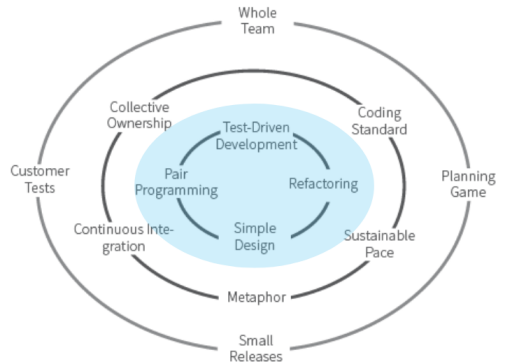

# my-xp-practices-journey
A list of resources on XP technical practices that I found interesting on my continuous journey learning, reflecting and coaching them.

# XP

## Articles
- 5 reasons why eXtreme Programming isn’t popular, Joshua Partogi https://medium.com/agility-path/5-reasons-why-extreme-programming-isnt-popular-83790418b901 [...XP is a good model for software delivery but unfortunately, the world is not necessarily attracted to what is ideal. What should happen in the software industry is not what actually happens ...]

## Talks
- XP in the 21st Century, Rachel Davies https://youtu.be/IDKJJDiK3Gw [Rachel talks about XP methodology in the year 2015 with examples of the software development culture in her organization.]

## Presentations
- Extreme Programming, Matteo Vaccari (14/3/2014) https://www.slideshare.net/xpmatteo/extreme-programming-32324409

# TDD

## Books
- Test Driven Development: By Example, Kent Beck

## Articles
- The three rules of TDD, Robert C. Martin http://butunclebob.com/ArticleS.UncleBob.TheThreeRulesOfTdd
- Do More With Baby-Steps TDD, Oleksii Fedorov http://www.tddfellow.com/blog/2016/10/19/do-more-with-baby-steps-tdd/
- Why do You Want Me to Write Bad Code, David Tanzer https://www.davidtanzer.net/david's%20blog/tdd/2018/08/21/why_do_you_want_me_to_write_wrong_code.html
- The Mysterious Art Of Triangulation, Jason Gorman http://codemanship.co.uk/parlezuml/blog/?postid=1157
- Read The Transformation Priority Premise, Robert C. Martin https://blog.cleancoder.com/uncle-bob/2013/05/27/TheTransformationPriorityPremise.html

### Misunderstandings about TDD
- What TDD Is and Is Not, Erik Dietrich https://daedtech.com/what-tdd-is-and-is-not

## Videos
- The 3 Laws of TDD: Focus on One Thing at a Time, Jon Reid https://qualitycoding.org/3-laws-tdd/
- “Episode 6: TDD” of Clean Coders, Robert Martin https://cleancoders.com/episode/clean-code-episode-6-p1/show

## Course
- [The World's Best Intro to TDD](https://www.jbrains.ca/training/the-worlds-best-introduction-to-test-driven-development), J. B. Rainsberger

# Refactoring

## Articles
- Technical debt 101, Maiz Lulkin (22/06/2014) https://medium.com/@joaomilho/festina-lente-e29070811b84
- Refactoring a javascript video store, Martin Fowler (18/05/2016) http://martinfowler.com/articles/refactoring-video-store-js
- Primitive Obsession, David Tanzer https://www.devteams.at/2019/02/04/primitive-obsession.html

## Presentations
- Refactoring, 2nd Ed. A love story. Michael Hunger. https://www.slideshare.net/jexp/refactoring-2nd-edition

## Resources
- Catalog of Refactorings, Refactoring Guru https://refactoring.guru/catalog
- Code Smells, Refactoring Guru https://refactoring.guru/smells

# Simple Design

## Articles
- The Four Elements of Simple Design, J.B. Rainsberger https://blog.jbrains.ca/permalink/the-four-elements-of-simple-design

# Pair Programming

## Articles
- Rethinking Pair Programming, Sandro Mancuso (15/03/2015) https://codurance.com/2015/03/15/rethinking-pair-programming
- Pair Programming Is No Panacea, Wes Higbee (09/05/2016) https://www.infoq.com/articles/pair-programming-no-panacea
- Life After Pair Programming, Jay Fields (30/08/2011)  blog.jayfields.com/2011/08/life-after-pair-programming.html
- Pair Programming – The Most Extreme XP Practice?, Dave Farley http://www.davefarley.net/?p=214
- Pair Programming for Introverts, Dave Farley http://www.davefarley.net/?p=267
- 21 ways to hate pair programming, William Pietri http://agilefocus.com/2009/01/06/21-ways-to-hate-pair-programming/

# Mob Programming

## Articles
- How Mob Programming Will Make You More Effective, Fagner Brack (12/10/2017) https://medium.com/@fagnerbrack/590a1b7e0418
